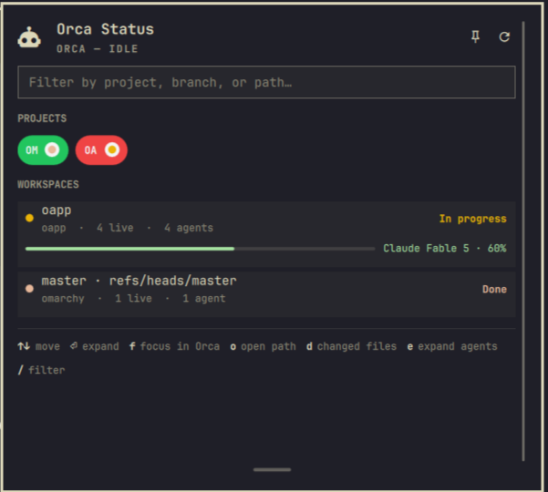

# Orca Status for Omarchy

Traffic-light status for [Orca](https://orca.dev) agents in the Omarchy bar, with a panel for projects and workspaces.



## Features

- **Bar semaphore** — green (working), yellow (waiting), red (blocked) without opening the panel
- **Projects** — durable Orca projects with active workspace counts
- **Workspaces** — worktrees with agent state, preview text, and expandable agent details
- **Actions** — focus a workspace in Orca (`orca terminal switch`), open its path, or open its changed files as diffs in Orca (`orca file open-changed`)
- **Agent output preview** — expanding a workspace shows the last lines of each agent's terminal, so you can see what an agent is asking without switching to Orca
- **Notifications** — desktop notification when a workspace becomes blocked (and optionally waiting)
- **Attention badge** — count of blocked + waiting agents next to the bar icon
- **Urgency sorting** — blocked workspaces first, then waiting, then working
- **Pin (keep open)** — pin the panel as a card in the top-right corner; it stays open while you work in other windows and never steals keyboard or mouse input. Unpin closes it.
- **Resizable panel** — drag the grip at the bottom edge to change the panel height (persisted)
- **Start Orca** — a button to launch Orca directly from the panel when it is offline

## Requirements

- Omarchy with shell plugins
- Python 3 on `PATH` (`python3`)
- Orca CLI on `PATH`, at `~/.config/orca/linux-orca-cli-shim/orca`, or set via `orcaCliPath`

Optional tools used by specific actions:

| Tool | Used for | If it is missing |
|------|----------|------------------|
| `notify-send` | Desktop notifications when a workspace becomes blocked or waiting | The notification is skipped. Status, the bar, and the panel keep working. `execDetached` does not report the failure. |
| `xdg-open` | Open a workspace path (`o`) | The panel still says the path was opened. The file manager does not start, and the failure is not shown. |
| `hyprctl` | Focus the Orca window after switching a terminal or opening changed files | The Orca command still runs. Focusing the window is skipped silently. |

Orca itself is required for live data. The backend looks up the binary with `shutil.which("orca")`, then the default shim path. When nothing is executable it returns `offline: true` and `Orca CLI not found.` The bar stays visible (Orca offline still shows the icon) and the panel offers **Start Orca**, which fails with the same error until a CLI exists. If the binary exists but Orca is not running, `orca status` fails and the panel shows that error instead, still as offline. Focus, terminal preview, and open-changed then return `Orca CLI not found.` or the underlying CLI error in the panel status line.

## Install

```bash
omarchy plugin add https://github.com/Morganczech/omarchy-orca-status.git --enable --yes
omarchy bar move gruut.orca-status --section right
```

Manual install:

```bash
git clone https://github.com/Morganczech/omarchy-orca-status.git ~/.config/omarchy/plugins/gruut.orca-status
omarchy-shell shell rescanPlugins
omarchy plugin enable gruut.orca-status --section right
```

## Remove

```bash
omarchy plugin remove gruut.orca-status
```

Removal disables the widget and deletes the plugin directory. Settings already saved in `shell.json` stay there.

## Configuration

In `~/.config/omarchy/shell.json` under the widget entry:

| Setting | Default | Description |
|---------|---------|-------------|
| `refreshIntervalSec` | 12 | Background refresh while panel is closed |
| `orcaCliPath` | `""` | Custom path to `orca` binary |
| `showWhenIdle` | `true` | Keep bar icon visible when no agents are active |
| `keepOpen` | `false` | Pin the panel so it stays open when clicking another window (also toggled by the pin button in the panel) |
| `notifyOnBlocked` | `true` | Desktop notification when a workspace becomes blocked |
| `notifyOnWaiting` | `false` | Desktop notification when a workspace starts waiting for input |
| `panelHeight` | — | Panel height in pixels, saved automatically when you drag the resize grip |

## Keyboard shortcuts

| Key | Action |
|-----|--------|
| `↑↓` | Move selection |
| `Enter` | Expand agents or focus workspace in Orca |
| `f` | Focus workspace in Orca |
| `o` | Open workspace path |
| `d` | Open changed files in Orca |
| `e` | Toggle agent details |
| `/` | Filter workspaces |
| `r` | Refresh |
| `Esc` | Clear filter / close panel |

## Panel behavior

- Opening the panel shows a card below the bar icon; clicking anywhere outside it closes it.
- The pin button (or the `keepOpen` setting) keeps the card open in the top-right corner. While pinned, keyboard and mouse input outside the card go to your other windows as usual; unpinning closes the card.
- Clicking a project chip filters the workspace list to that project; clicking it again clears the filter.
- Expanding a workspace loads a short terminal preview for each of its agents; press `r` to refresh both the status and the previews.

## Development

```bash
python3 test_orca_status.py
python3 orca-status.py
omarchy plugin validate ~/.config/omarchy/plugins/gruut.orca-status
```

## License

MIT
